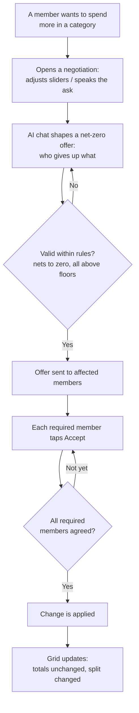
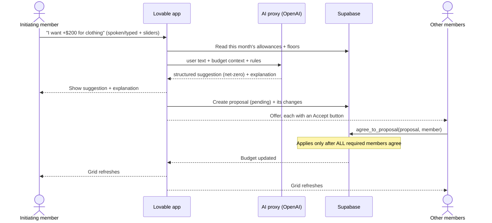
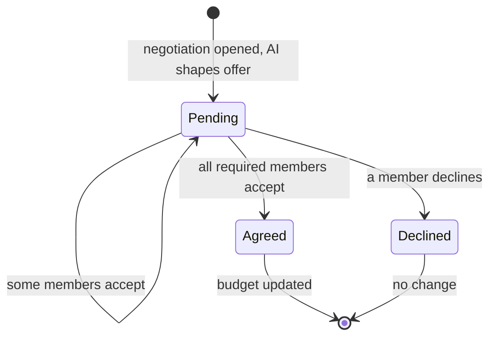

# Player game-flow experience

How the game plays from a family member's point of view, and what happens
underneath each step. Diagrams are Mermaid — they render on GitHub.

## The setting

A family (Parent 1, Parent 2, Teen 1) shares a monthly budget shown as a **grid**:
7 spending categories down the side, a column per member, and a computed **Family**
column. Each cell is that person's **allowance** for the month. A separate
**savings goal** ($5,000) shows as a single number, with the amount already saved
entered by a member at setup (spoken via a dictation tool, or typed).

The demo opens at the **September baseline** — real allowances, no negotiations
yet — so the very first negotiation is performed live.

## The core loop, in plain terms

1. **Someone wants more.** A member wants to spend more in a category — say Teen 1
   wants more clothing. They open a negotiation by adjusting **sliders** and/or
   **speaking** the ask (their voice is turned into text by the dictation tool).
2. **The AI helps shape a fair offer.** The AI chat works with that member to find
   a move that obeys the rules: it must **net to zero** (someone gives up what
   someone else gains) and **never push anyone below their floor**. It hands back a
   structured suggestion plus a friendly explanation.
3. **The offer goes to the others.** The members being asked to give up allowance
   see the offer, each with an **Accept** button.
4. **Everyone must agree.** The budget changes **only once every required member
   has accepted** — one holdout means nothing moves.
5. **It applies, and the grid updates.** The redistribution is written; each
   person's allowance shifts, but the category and household totals stay the same.

### The negotiation loop

## What talks to what

The player only ever sees the app; everything else happens behind it. Voice is
turned into text before it reaches the app, so nothing here handles audio.

## A proposal's life

This mirrors the `status` values in the database.

## Who builds each piece

- **Front end (Lovable):** the grid, the sliders, the chat window, the Accept
  buttons, and (optional) reading the AI reply aloud. These *call* the backend and
  the `agree_to_proposal` function.
- **Backend (yours):** the AI proxy that turns the ask + budget context into a
  structured, rule-obeying suggestion.
- **Database (yours, built):** `agree_to_proposal` — the only thing that changes a
  budget. It re-checks net-zero, floors, and "all required members agreed" before
  applying, so a bad suggestion can never corrupt the budget.

## Two things the team still needs to decide

1. **How does the savings goal actually grow?** In the current model, negotiations
   only **redistribute** discretionary allowance (net-zero) — they don't move money
   into savings. If players should see the savings number climb, that needs its own
   action (e.g., "everyone trims a little, send it to savings"), which is *not*
   net-zero and would need a separate path. Right now savings is a static number
   entered at setup. Worth resolving before the demo, since a player will expect it
   to move.
2. **One Accept, or one per person?** A real negotiation means each member who
   gives up allowance accepts (the clothing move = two parents accepting). You can
   stay true to that, or take a single-click shortcut that applies for everyone.
   A product call for the architect + front-end builder.
